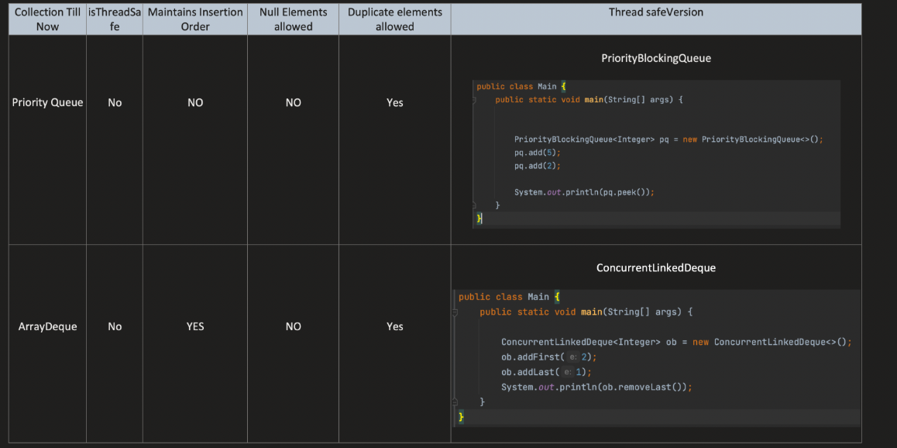
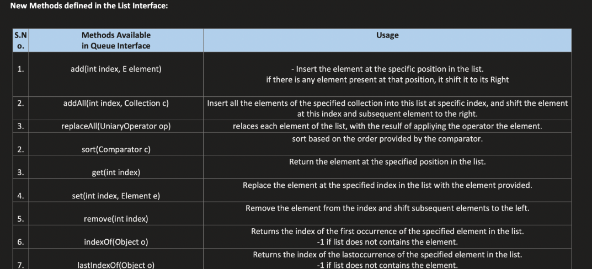
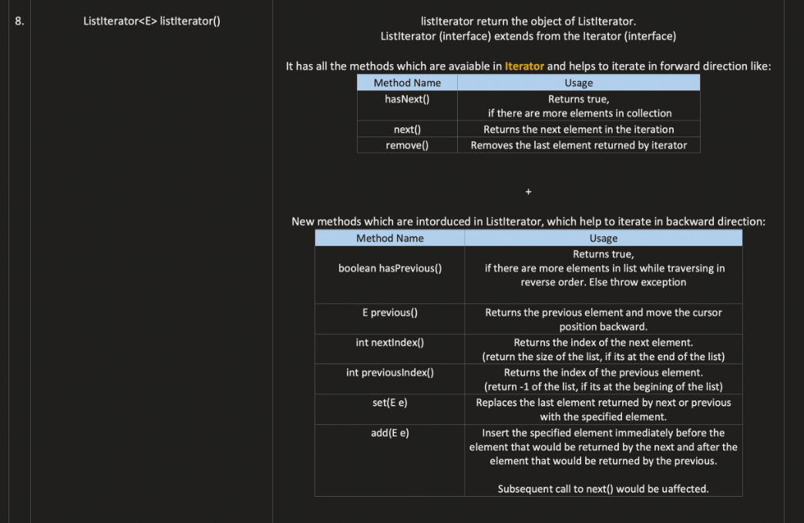
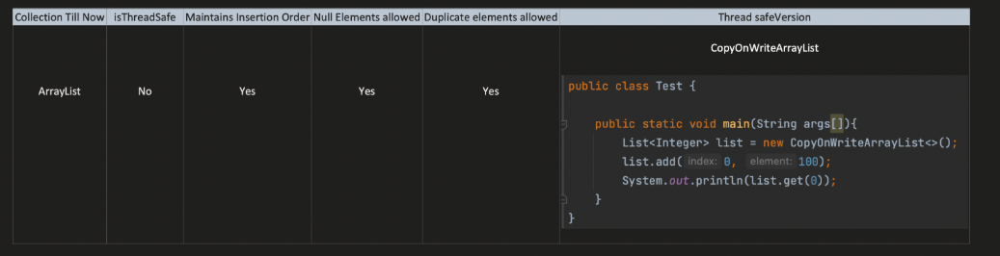
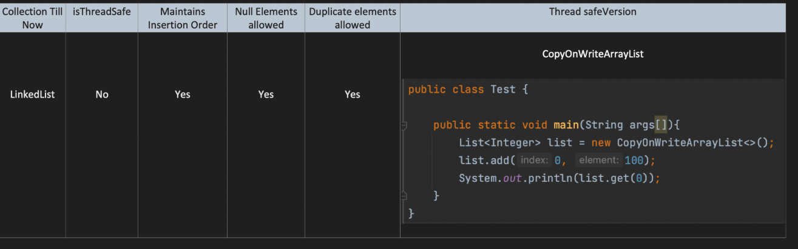
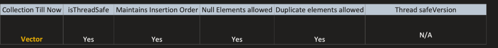
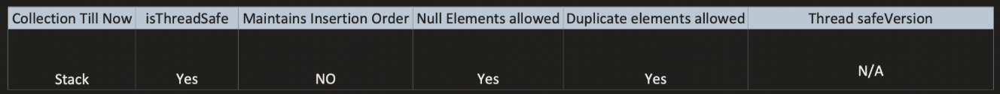

# Java-Collections-Framework-
Added in java 1.2 Version
Collections nothing but group of objects, present in java.util package
Collections Framework provides us the architecture to mange "group of objects" i.e update,add,delete,search etc

Iterable Interface provides the below methods

Collection Interface provides the below methods

Queue Interface provides the below methods

Iterable Interface provides the below methods

Collection Interface provides the below methods

Queue Interface provides the below methods

# Compartor Vs Comparable 

    when we do sort on primitives , for ex 
    we have Integer arr[] = new Integer[]{3,6,3,3};

#Arrays.sort(arr);

    -In here when we do sort, internally it calls merge sort and merge sort internally calls compareTo() method
    - Provided by the Integer class, Integer class implements Comparable Interface, it provides/Overrides the compareTo() method
    - It picks up to sort the array , that compareTo() methods defines the Natural Ordering of the class.

#Arrays.sort(arr,(Integer val1,Integer val 2) -> val1 - val2)
    -In here we provided custom comparator by lambda expression, It internally class the merge sort,
    -and that merge sort internally calls compare() method provided by the user,It will not pick the natural ordering
    -CompareTo() method, as the user provided the custom sorting logic comparator() method.

The same thing, when we do for Objects 

# Let's Assume that there exist car class with carName,carType with constrcutor initialization for both the fields
 
    car carArr = new car[3];
    carArr[0] = new car("Benz", "Petrol");
    carArr[1] = new car("Audi", "diesel");
    carArr[2] = new car("RangeRover", "diesel");

#Arrays.sort(carArr)

    -So when this executes, What do you think it will happens, it sorts,or remains same 
    -It fails as classCastException for compareTo() method is not applicable.
    -as we've seen that when ever arrays.sort executes, it internally calls merge sort, & it internally 
    - checks if any custom compartor provided or not , if not provided it goes for it's own natural ordeing
      - But in this car class , we've not defined any natural ordering,So it fails.

#Arrays.sort(carArr,(car o1,car o2) -> o1.carName.compareTo(o2.carName);

    -Now, what do you think that would happen, if we execute this line,it works fine,
    - How, Internally it calls the merge sort, & it internally checks for the custom/user provided sorting 
    - comparator, based upon the logic the sorting/swapping would take place.

# Now the Question what to do incase if we haven't provided any custom comparator sorting logic.
    - the class need's to implement comparable Functional Interface to override the compareTo() method
    - that internally will be the one & only method that define the default Natural Ordering of the class
    -Then we can call Array.sort(carArr) it works fine,

# Comparator 
            
    -no need to change anything in Object class, can define multiple ways , 
    - can have multiple sorting strategies, compare(T obj1, T obj2) Method need's to implement
# Comparable 
        
    - need to change in Object Class &  have only one natural ordering
    - CompareTo(T Obj) need to override in the object class
# Dequeue

    -Deque is Double Ended Queue Means Addition & Deletion Can be done from either sides of the queue
    -The below methods are available in Dequeue

        addFirst() & offerFirst() - Both does insertion at the first, but incase of
        addFirst() -> throws Exception if insertion fails
        offerFirst() -> returns false if insertion fails
    
         addLast() & offerLast() -> Both does insertion at the end of the queue, but the difference would be
         addLast() -> throws Exception if insertion fails
         offerLast() -> returns false if insertion fails
    
         removeLast() & pollLast() - Both does Deletion at the end, but diff
         removeLast() -> throws exception if deletion fails
         pollLast() -> returns null if queue is empty
    
         removeFirst() & pollFirst() - Both does Deletion at the end, but diff
         removeFirst() -> throws exception if deletion fails
         pollFirst() -> returns null if queue is empty
    
         peekFirst() & getFirst() -> Both retrieve the start/head element from the queue
         peekFirst() -> Returns Null,if queue is empty
         getFirst() -> Returns Exceptions if the queue is empty
    
         peekLast() & getLast() > Both retrieve the start/head element from the queue
         peekLast() -> Returns Null,if queue is empty
         getLast() -> Returns Exceptions if the queue is empty

        push() -> Internally calls addFirst()
        pop() -> Internally calls removeFirst()

    - Methods from Queue can will be available for Dequeue

         1.add() -> Internally calls the addLast() method
         2.offer() -> Internally calls the offerLast() method
         3.remove() -> Internally calls the removeFirst() method
         4.poll() -> Internally calls the pollFirst() method
         5.peek() -> Internally calls the peekFirst() method
         6.element() -> Internally calls the getFirst() method

    -Time Complexity
        - Insertion :(Average it takes O(1) Expect for few case, Like when the queue size threshold reached
                     & trying to insert an element at end or front , then O(n) values are need to copy to new bigger queue
        - Removal : O(1)
        -Search :  O(1)

# Thread Safe Version of ArrayDequeue & PriorityQueue
For Priority Queue -> it's PriorityBlockingQueue which is Thread SafeVersion
For ArrayDequee  -> It's ConcurrentLinkedDeque which is thread SafeVersion
Has the behaviour of Concurrent insertion, removal, and access operations execute safely across multiple threads

# List 
    -It's Ordered collection of objects, which allows duplicate values.
    -How it's diffenet from queue's ?
    -Queue is also a collection of Objects, where insertion,deletion,access happens either from the start or end of queue
    - where as in List Insertion,deletion & Acces can be happen at anywhere
    -In List those operation happens via index(Starting from  0)
    -Methods provided by in List Interface
    
    
    -Time Complexity
        -Insertion:
            -O(1): when inserting an element at the end of list , when space is sufficient
            -O(n): when inserting an element at particular index,then requires shifting of elements 
            -O(n): when array size reaches the threshold & try to insert at the end, then also it requires O(n) to copy 
                    all the elements to the new array 
        -Deletion:
            -O(n) : after deletion,shifting of element requries O(n)    
        -search 
            -O(1) : by indexes it takes constant time

# Thread Safe Version of ArrayList
For ArrayList -> it's CopyOnWriteArrayList which is Thread SafeVersion

# LinkedList 
    - LinkedList is the concrete class, which implements both Dequeue & List Interface
    - It supports Dequeue Methods like "getFirst()", "getLast()", "removeLast()" etc And
    - It supports Index Based Operations like "get(index)","add(index,val)" etc..
    - It's faster than ArrayList, becuase there is "no shifting of element requires"
    -Time Complexity
        -Insertion:
            -O(1): Insertion at end or start 
            -O(n): Insertion at particular index for lookup O(n) + O(1) for adding 
        -Deletion:
            -O(1) : deletion at end or start
            -O(n) : deletion at particular index for lookup O(n) + O(1) for removal
        -search 
            -O(n) : Need to traverse whole linkedlist in worst case
    
# Vector
    -Exactly same as ArrayList,elements can be access via index
    -But it's Thread Safe
    -Puts lock on each & every Operation it performs on vector
    -Less efficient than arrayList as for each operation it do lock/unlock internally
    -Each & every method in vector is synchronized.
    
# Stack
    -It's child concrete class of Vector class
    -we can achieve LIFO (principle ) through Dequeue , but that is not a threadSafe 
    -Stack is ThreadSafe as it's child of Vector 
    -Time Complexity
        -Insertion:
            -O(1): Insertion from end only
        -Deletion:
            -O(1) : deletion from end only
        -search
            -O(n) : Need to traverse whole stack , worst case need to traverse entire stack elements
    
    
